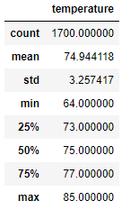
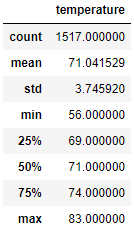

# "Surf's Up" Analysis Using Python and SQLAlchemy

## Overview of Analysis

### Purpose
The purpose of this analysis was to show the temperature data for the months of June and December in Oahu in order to determine if a surf and ice cream shop business is sustainable year-round.

## Results
I first imported the dependencies for NumPy, Pandas, and SQLAlchemy as I was querying a SQLite database.

```
import numpy as np
import pandas as pd

import sqlalchemy
from sqlalchemy.ext.automap import automap_base
from sqlalchemy.orm import Session
from sqlalchemy import create_engine, func
```

I then created an engine, set up a base class for an automap schema, and created a session link to the database.

```
engine = create_engine("sqlite:///hawaii.sqlite")

Base = automap_base()
Base.prepare(engine, reflect=True)

Measurement = Base.classes.measurement
Station = Base.classes.station

session = Session(engine)
```

To find the temperature data for the month of June in Oahu, I wrote a query that filters the date column from the Measurement table and converted the June temperatures to a list.

```
from sqlalchemy import extract

june_results = []
june_query = session.query(Measurement.date, Measurement.tobs).filter(extract('month', Measurement.date) == 6)

june_results = list(june_query)
```

I then created a DataFrame from the list of temperatures and generated the summary statistics for the June temperatures.

```
june_df = pd.DataFrame(june_results, columns=['date','temperature'])
june_df.set_index(june_df['date'], inplace=True)
print(june_df.to_string(index=False))

june_df.describe()
```

The output from running the code produced the following summary statistics for the June temperatures:



To find the temperature data for the month of December in Oahu, I wrote a script similar to what was written to find the June temperatures where the Measurement table is filtered by date, created into a DataFrame, and then the summary statistics were generated.

```
december_results = []
december_query = session.query(Measurement.date, Measurement.tobs).filter(extract('month', Measurement.date) == 12)

december_results = list(december_query)

december_df = pd.DataFrame(december_results, columns=['date','temperature'])
december_df.set_index(december_df['date'], inplace=True)
print(december_df.to_string(index=False))

december_df.describe()
```

The output from running the code produced the following summary statistics for the December temperatures:



### Summary of Results
- Generally, as one might predict, the December temperatures are overall lower than the June temperatures. The minimum December temperature was 56°F while the minimum June temperature was 64°F, with temperatures in each of the December quartiles lower than the June quartiles.
- However, the mean temperature between the June and December months only had a difference of about 4 degrees Fahrenheit. The June mean tmeperature was 75°F and the December mean temperature was 71°F.
- While the December dataset has about 200 less temperatures than the June dataset, I feel the datasets can be safely compared as the difference between the number of datapoints is not too large and the standard deviations of both datasets are similar (3.26 for June and 3.75 for December).

## Summary
